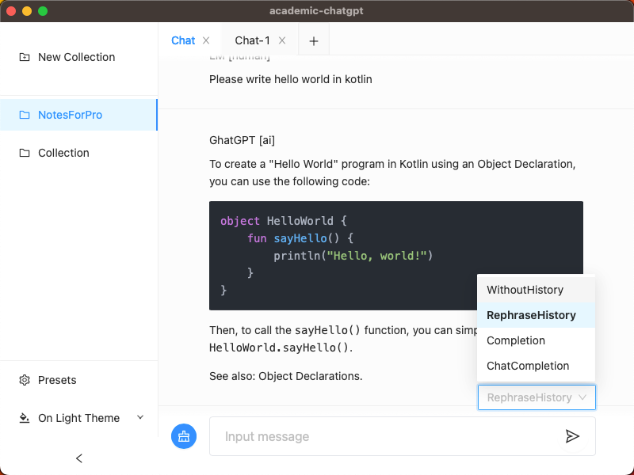
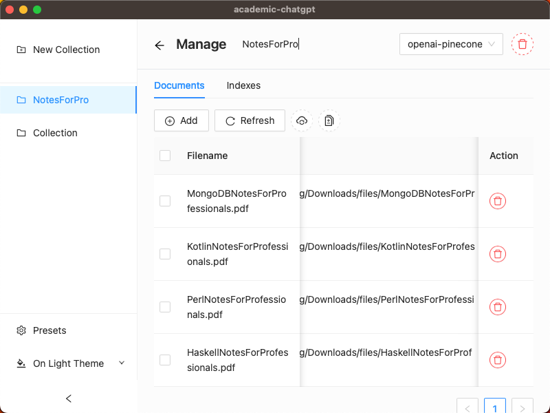

# Academic Chatgpt

A chatbot that allows users to chat with a collection of documents files.

## Snapshots

Chat with collection of documents files. Supports of various completion styles.



Collection dashboard. 



## Setup

Academic-chatgpt is built on [Nuxt 3](https://nuxt.com/) + [tauri](https://tauri.app/). So before you start, make sure you have the following installed:

- [Node.js](https://nodejs.org/en/) for using yarn/npm/pnpm;
- [Tauri](https://tauri.app/v1/guides/getting-started/prerequisites) for using `cargo tauri`.

Once you have prepared the build env, clone the repository and install the dependencies:

```bash
# clone the project
git clone https://github.com/limoiie/academic-chatgpt.git

# install the dependencies by either yarn
yarn install
# or npm
npm install
# or pnpm
pnpm install

# install the tauri cli
cargo install tauri-cli
```

After that, run following command to initialize the database schema at your first run:

```bash
cargo prisma generate --schema=./src-tauri/prisma/schema.prisma
```

## Development

Start the development application:

```bash
cargo tauri dev
```

## Production

Build the application for production:

```bash
cargo tauri build
```

## Run as a Browser Application

Start the development application with feature `http-invoke` enabled:

```bash
cargo tauri dev --features http-invoke
```

## Usage

Academic-chatgpt needs [openai api](https://platform.openai.com/overview) to embedding documents and [pinecone api](https://www.pinecone.io/) for storing, indexing and searching the documents by the embeddings.
So, please follow the following instructions to create accounts for both openai api and pinecone, and get necessary informations.

- create your openai api key at [here](https://platform.openai.com/account/api-keys);
- create your pinecone api key and index at [here](https://app.pinecone.io/);
  - **NOTE**: when dimension of the index should be 1536, as it is embedding size of openai embeddings;
  - retrieve the environment bound with api key and index name from the console.

You will be asked for providing these keys when you first run the application.
